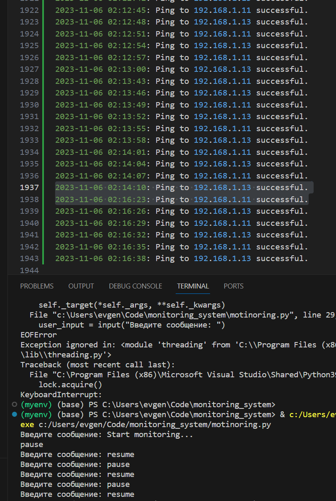

# monitoring_system

### Функциональные Требования:
- Перед началом мониторинга, система должна подключиться к
каждому устройству и настроить его так, чтобы устройство стало
доступным для ICMP пинга.
- Система должна опрашивать состояние устройств через ICMP (ping).
- Результаты опроса должны записываться в лог-файл, содержащий
информацию о времени опроса, IP-адресе устройства и
результате опроса.
- В случае, если устройство не отвечает более N раз, система должна
отправлять уведомления администратору на почтовый ящик.
- На вход системе подается YAML файл, содержащий:
- Список устройств и данные для их подключения.
- Путь к файлу для логирования.
- Почтовый ящик для отправки уведомлений.
- Количество неудачных попыток подключения, после
которых следует отправить уведомление.

### Дополнительные требования и уточнения:
- Система предполагает работу с устройствами, имеющими
интерфейс командной строки, похожий на Cisco CLI.

- Допускается использование существующих python framework
- Формат YAML файла определяется исполнителем в процессе
реализации.

- Ожидается, что реализация будет содержать избыточность в
архитектуре для учета возможного расширения функционала.
- Ожидается предоставление списка предложений по расширению
функционала системы с учетом добавленных архитектурных
решений для их реализации.

# Документация системы мониторинга

## Введение
Система мониторинга предназначена для мониторинга состояния сетевых устройств, таких как роутеры и свитчи. Она позволяет автоматически проверять доступность устройств и отправлять уведомления в случае недоступности.

## Установка и настройка
### Требования к системе
- Python 3
- Дополнительные зависимости (указать, если есть)

### Установка
1. Склонируйте репозиторий.
2. Установите необходимые зависимости: `pip install -r requirements.txt`.
3. Настройте файл конфигурации `settings.yaml`.

### Конфигурация
Редактируйте файл `settings.yaml` для настройки системы. Он содержит следующие параметры:
- Список устройств и данные для их подключения.
- Путь к файлу для логирования.
- Почтовый ящик для отправки уведомлений.
- Количество неудачных попыток подключения, после которых следует отправить уведомление.

## Использование системы
### Добавление устройств
Для добавления устройств в мониторинг, отредактируйте файл `settings.yaml`, добавив информацию о каждом устройстве.

### Запуск мониторинга
Запустите мониторинг, выполнив команду `python monitoring.py`.

### Управление паузой
Чтобы поставить мониторинг на паузу, используйте команду `pause`. Для возобновления мониторинга используйте `resume`.

### Получение уведомлений
Система будет отправлять уведомления на почтовый ящик, указанный в конфигурации, если какое-то устройство станет недоступным.

## Расширенные возможности
<!-- ### API
Система предоставляет API для взаимодействия с ней (описать API и его использование). -->

### Расширенные возможности
- Данная система имеет потенциал развития, как отечественный аналог Cisco CLI. Ее функционал можно было бы расширить добавлением методов для добавления и удаления устройст во время работы программы через CLI.

## Примеры

## Заключение
Данная система мониторига была разработана в качестве тестового задания на должность стажера-разработчика в компанию Aquarius.

